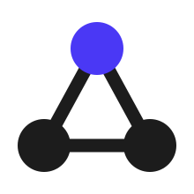
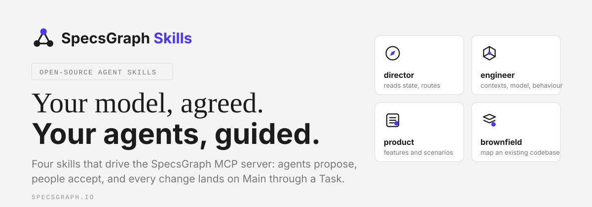
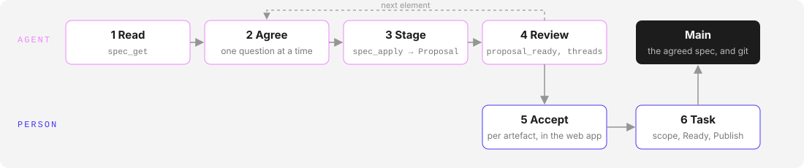

<p align="center">
  <a href="https://specsgraph.io">
    <picture>
      <source media="(prefers-color-scheme: dark)" srcset="assets/logo-mark-dark.svg">
      
    </picture>
  </a>
</p>

<h1 align="center">SpecsGraph Skills</h1>

<p align="center">
  <strong>Agent Skills that turn Claude Code, Cursor, Codex and GitHub Copilot into a SpecsGraph domain-modelling partner.</strong><br>
  Open-source, plain Markdown, driven entirely through the SpecsGraph MCP server.
</p>

<p align="center">
  <a href="https://github.com/SpecsGraph/specsgraph-skills/blob/main/LICENSE"></a>
  <a href="https://github.com/SpecsGraph/specsgraph-skills/blob/main/CHANGELOG.md"></a>
  <a href="#install"></a>
  <a href="https://specsgraph.io/docs/agents"></a>
  <a href="https://specsgraph.io"></a>
</p>

<p align="center">
  
</p>

> **Looking for SpecsGraph itself?** This repository holds only the Agent Skills. The product and its docs live at [specsgraph.io](https://specsgraph.io).

## Table of contents

- [What is SpecsGraph?](#what-is-specsgraph)
- [The four skills](#the-four-skills)
- [How the skills work](#how-the-skills-work)
- [Install](#install)
- [Connect the MCP server first](#connect-the-mcp-server-first)
- [Set up a repository](#set-up-a-repository)
- [Example prompts](#example-prompts)
- [Updating](#updating)
- [Repository layout](#repository-layout)
- [Design principles](#design-principles)
- [FAQ](#faq)
- [What this plugin runs and sends](#what-this-plugin-runs-and-sends)
- [Security](#security)
- [Contributing](#contributing)
- [License](#license)

## What is SpecsGraph?

[SpecsGraph](https://specsgraph.io) is an open-source specification platform where product teams and their AI coding agents keep one living, typed model of a system: subdomains and bounded contexts, the aggregates, value objects and enums inside them, use cases, event handlers and scheduled jobs, data contracts, read models and integration events, plus features with Gherkin scenarios, a glossary and roles. Work happens in workstreams, agent edits are staged in proposals for people to accept, and agreed changes are published to **Main** and to your git repository.

Agents reach the model through the **SpecsGraph MCP server** (streamable HTTP, OAuth sign-in or a personal access token). The server has the same capabilities as the web app. These skills add the guided workflows on top, so an agent knows *when* to read, *what* to ask, and *how* to stage a change the team will accept.

## The four skills

| | Skill | What it does | Use it when |
| :-: | --- | --- | --- |
|  | **`specsgraph-director`** | Reads the project state and routes to the right specialist. Never writes. | "Let's spec this out", "where do I start?", "set up SpecsGraph for this repo" |
|  | **`specsgraph-engineer`** | Domain modelling by interview: subdomains, bounded contexts, aggregates and invariants, use cases and outcomes, contracts, glossary, roles. Agent proposes, the team ratifies. | "Model this", "where does the boundary go", "what invariants does Parcel have" |
|  | **`specsgraph-product`** | Features, scenarios, roles and terms in plain language. No DDD vocabulary needed. | "Write the scenarios for X", "spec this feature", "capture these acceptance criteria" |
|  | **`specsgraph-brownfield`** | Maps an existing codebase into the model one seam at a time, with evidence and confidence on every proposal. | "Point SpecsGraph at this repo", "what does the current system actually do?" |

All four require a connected SpecsGraph MCP server. SpecsGraph ships no AI of its own. The skills run on the agents you already use.

## How the skills work

<p align="center">
  
</p>

1. **Read.** `spec_get` through the workstream returns Main plus the workstream's accepted changes as YAML spec documents, one per artefact.
2. **Agree.** One question at a time, each carrying a recommended answer. Nothing is written until the user says yes.
3. **Stage.** `spec_apply` sends one document into the workstream's open Proposal. The server diffs it, returns the artefact id, and records what it depends on.
4. **Review.** `proposal_ready` tells editors there is something to look at. Comments become `thread_reply` answers or a re-staged document.
5. **Accept.** A person accepts each revision on the Proposals page. The server refuses an agent that tries.
6. **Task and publish.** People scope the agreed changes into a Task, mark it Ready and publish. Only that lands on Main and in git.

The model holds **14 artefact kinds** in five groups:

| Group | Kinds |
| --- | --- |
| Domain | Subdomain, Bounded context |
| Model (inside a context) | Aggregate, Value object, Enum |
| Behaviour | Use case, Event handler, Scheduled job |
| Contracts | Data contract, Read model, Integration event |
| Product | Feature with scenarios, Glossary term, Role |

Every skill carries the same *SpecsGraph loop* section, so each one installs and works on its own.

## Install

### Claude Code (plugin marketplace)

```bash
/plugin marketplace add SpecsGraph/specsgraph-skills
/plugin install specsgraph
```

The plugin brings the four skills, the SpecsGraph MCP server (`https://mcp.specsgraph.io/mcp`), the `/specsgraph:setup` command and a session reminder hook. After installing, run `/mcp`, pick `specsgraph` and sign in in the browser; then run `/specsgraph:setup` in each repository whose spec lives in SpecsGraph.

### Claude.ai

Zip one skill folder from `skills/` and upload it under **Customize → Skills**. Team and Enterprise owners can provision skills for the whole organisation.

### Cursor, Codex, GitHub Copilot and other agents

The skills are portable `SKILL.md` files and follow the `.agents/skills/` convention:

```bash
npx skills add SpecsGraph/specsgraph-skills
```

or copy the folders under `skills/` into your agent's skills directory.

## Connect the MCP server first

The skills detect SpecsGraph by its tool names (`project_list`, `spec_get`, `spec_apply`, `workstream_list`), whatever name you gave the connection.

**Claude Code with the plugin:** nothing to add. The plugin declares a server named `specsgraph` at `https://mcp.specsgraph.io/mcp`; run `/mcp`, pick it and sign in with your SpecsGraph account (OAuth). To point it at another SpecsGraph server, set `SPECSGRAPH_MCP_URL` to that server's full MCP URL before starting Claude Code.

**Clients without OAuth, or without the plugin:** the plugin itself never reads a token. Clients that cannot sign in with OAuth can use a personal access token instead; the [agents documentation](https://www.specsgraph.io/docs/agents) shows where to create one and how each client sends it.

Configuration for Cursor, VS Code and other clients is in the [agents documentation](https://www.specsgraph.io/docs/agents).

## Set up a repository

`/specsgraph:setup [project name]` checks the connection with `project_list`, asks which project the repository belongs to, and proposes a "Specs live in SpecsGraph" section for `AGENTS.md` (plus an `@AGENTS.md` line in `CLAUDE.md`, which is the file Claude Code reads). It shows the diff and writes only after you approve. The section sits between `<!-- specsgraph:begin -->` and `<!-- specsgraph:end -->`, so running the command again updates it in place instead of adding a copy. Commit both files so every agent on the team gets the same instructions.

In a repository with that marker, or when `SPECSGRAPH_PROJECT` is set, the plugin's SessionStart hook adds four lines to each new session: the spec lives in SpecsGraph, read before changing behaviour, stage with `spec_apply`, cite display ids in commits. Other repositories get nothing.

## Example prompts

```text
Let's spec the parcel dispatch flow.              → director routes to engineer
Write the scenarios for parcel tracking.          → product
Where does the boundary between Shipping and Notifications go?   → engineer
Point SpecsGraph at this repo and start from the /dispatch endpoint.  → brownfield
```

## Updating

Releases follow [SemVer](https://semver.org); see [CHANGELOG.md](./CHANGELOG.md).

| Channel | Command |
| --- | --- |
| Claude Code | `/plugin marketplace update specsgraph` (third-party marketplaces do not auto-update by default) |
| `npx skills` installs | `npx skills update` |
| Claude.ai uploads | re-zip and re-upload the changed skill folder |
| Manually copied folders | re-copy, or switch to `npx skills add SpecsGraph/specsgraph-skills` |

## Repository layout

```
.claude-plugin/            plugin and marketplace manifests
.mcp.json                  the SpecsGraph MCP server the plugin connects
commands/setup.md          /specsgraph:setup
hooks/hooks.json           SessionStart hook
scripts/session-context.sh the hook's script (POSIX sh, no network)
scripts/tools.json         snapshot of the MCP tools and their arguments
scripts/gen-tools.mjs      regenerates tools.json from the SpecsGraph monorepo
scripts/check-skills.mjs   checks every tool and argument the skills name (CI)
.github/workflows/         plugin validation and the check, on every push
assets/                    logo, banner, icons, diagrams
skills/
  specsgraph-director/     SKILL.md
  specsgraph-engineer/     SKILL.md
  specsgraph-product/      SKILL.md
  specsgraph-brownfield/   SKILL.md
CHANGELOG.md               release notes
RELEASING.md               maintainer checklist
```

## Design principles

- **Agents propose, people accept.** Every element is agreed in conversation before it is staged, and everything staged waits in a Proposal. Accepting, resolving threads, scoping Tasks and marking them Done are human acts, and the server enforces that.
- **Behaviour first.** Concrete examples before general rules; Gherkin scenarios prove the rules; the engineer and product seats check each other's coverage.
- **The user's words are the spec.** No paraphrase, no invented detail. Anything the user did not say becomes a question or a thread, never a claim.
- **Teach on arrival.** No DDD vocabulary is required up front. Each concept is explained in one plain sentence the first time it appears.
- **Honest ingest.** Brownfield mapping is incremental, cites `file:line`, and carries a confidence. A small confirmed model beats a large guessed one.
- **The right kind, at the right time.** SpecsGraph has a kind for aggregates, use cases, events and contracts, so agreed structure goes into its kind, and stays as a line of prose in the owning context until it is agreed.
- **Inspectable.** Everything the skills will make your agent do is in this repository, readable before you install it.

## FAQ

**Do I need all four skills?** No. Each `SKILL.md` is self-contained. Most teams install the plugin and let the director route.

**Can an agent publish to Main?** No. No MCP tool accepts a revision, resolves a thread, scopes a Task or marks it Done. Those are person-only in SpecsGraph.

**Which clients are supported?** Any MCP client that speaks streamable HTTP with OAuth or custom headers: Claude Code, Cursor, VS Code with GitHub Copilot, Codex, and stdio-only clients through `mcp-remote`.

**Can I use another SpecsGraph server?** Yes. Set `SPECSGRAPH_MCP_URL` for the plugin, or register the server by hand with its URL. The skills only need the tools.

## What this plugin runs and sends

- **MCP server.** The plugin connects Claude Code to `https://mcp.specsgraph.io/mcp`, or to `$SPECSGRAPH_MCP_URL` when set, over streamable HTTP. You sign in with OAuth through `/mcp`; no token is stored in the plugin. Each tool call sends the arguments Claude passes (spec documents, thread replies, workstream and task edits) to that server.
- **SessionStart hook.** Runs `scripts/session-context.sh` from the plugin directory at session start. It reads `AGENTS.md` in the repository and the `SPECSGRAPH_PROJECT` variable locally, prints up to four lines of context, and makes no network call and no write.
- **`/specsgraph:setup`.** Calls `project_list`, then writes `AGENTS.md` (and `CLAUDE.md`) only after showing the diff and asking.
- **Skills.** Instructions only, no code.
- **Nothing else.** No other endpoint, no telemetry, no installed software. `scripts/check-skills.mjs` and `scripts/gen-tools.mjs` are maintainer tools for CI and are never run by the plugin.

How SpecsGraph handles your data: [specsgraph.io/privacy](https://www.specsgraph.io/privacy). Support: [support@specsgraph.io](mailto:support@specsgraph.io).

## Security

The skills drive your connected SpecsGraph server and, for brownfield work, read the codebase you point them at. They install no software, call no other endpoint, and ship no model. The plugin's only script is the SessionStart hook in `scripts/session-context.sh`: it reads `AGENTS.md` and `SPECSGRAPH_PROJECT`, prints text, and makes no network call and no write. `/specsgraph:setup` edits `AGENTS.md` and `CLAUDE.md` only after you approve the diff. Read the `SKILL.md` files; that is the point of publishing them.

## Contributing

Issues and pull requests are welcome. Keep each skill installable on its own, keep frontmatter descriptions free of `": "` (strict YAML parsers skip the skill otherwise), and bump the version in `.claude-plugin/plugin.json` with every behaviour change. See [RELEASING.md](./RELEASING.md).

## License

[Apache-2.0](./LICENSE). Copyright 2026 SpecsGraph.

<p align="center">
  <sub>SpecsGraph · domain-driven design · specification · MCP · Agent Skills · Claude Code · Cursor · GitHub Copilot · Codex</sub>
</p>
